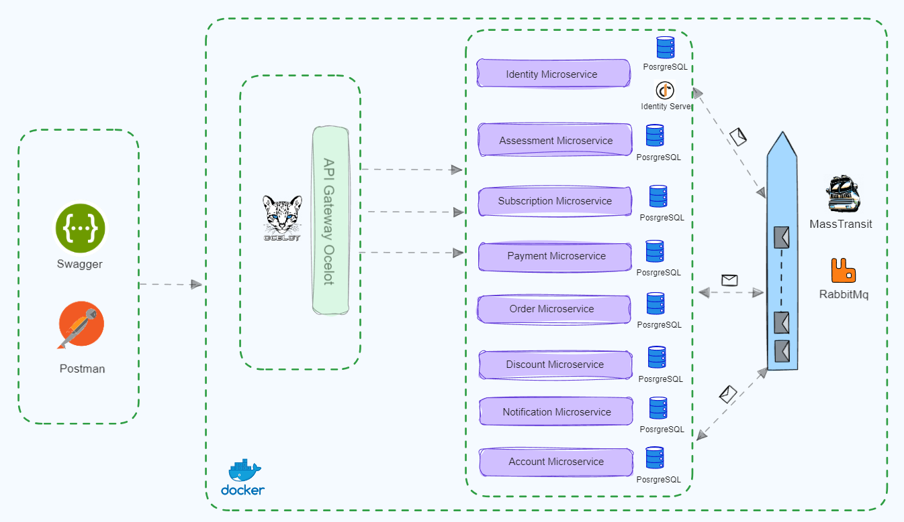

# Hexarch : .NET sample microservices application #

Hexarch is a sample containerized application consisting of several microservices.
Its purpose is to use microservice patterns in practice.

Development is still in progress. 

[Wiki](https://github.com/rifat-simoom/hexarch/wiki)  

[Getting Started](https://github.com/rifat-simoom/hexarch/wiki/Getting-Started)

[Saga Orchestration with MassTransit and RabbitMq](https://github.com/rifat-simoom/hexarch/wiki/Saga-Orchestration-with-MassTransit-and-RabbitMq)

[Eventual Consistency with Integration Events using RabbitMq](https://github.com/rifat-simoom/hexarch/wiki/Eventual-Consistency-with-Integration-Events-using-RabbitMq)

[API Gateway with Ocelot](https://github.com/rifat-simoom/hexarch/wiki/API-Gateway-with-Ocelot)

[Authorization and Authentication with IdentityServer](https://github.com/rifat-simoom/hexarch/wiki/Authorization-and-Authentication-with-IdentityServer)

[Distributed Logging with ElasticSearch, Kibana and SeriLog](https://github.com/rifat-simoom/hexarch/wiki/Distributed-Logging-with-ElasticSearch,-Kibana,-and-SeriLog)

[Resiliency and Fault Tolerance with Polly](https://github.com/rifat-simoom/hexarch/wiki/Resiliency-and-Fault-Tolerance-with-Polly)

[Health Check with WatchDogs](https://github.com/rifat-simoom/hexarch/wiki/Health-Check-with-WatchDogs)

[Distributed Tracing with Jaeger and OpenTelemetry](https://github.com/rifat-simoom/hexarch/wiki/Distributed-Tracing-with-Jaeger-and-OpenTelemetry)

[Metrics to Monitor Microservices with OpenTelemetry and Prometheus](https://github.com/rifat-simoom/hexarch/wiki/Metrics-to-Monitor-Microservices-with-OpenTelemetry)

---

## Hexarch Microservices Architecture Overview

## Contributing
:star: Star this project on GitHub - it's the first step to become a Hexarch supporter!

Contributions are welcome! If you find a bug or have an idea for a new feature, please open an issue or submit a pull request.   

## Tech Stack
  
  

## Todos ## 
- Eventual Consistency with Change Data Capture(CDC) and Outbox pattern (Debezium) 
- Outbox/Inbox patterns for inter-service communication 
- Integration Tests with Consumer Driven Contracts (Pact) 
 

## References

[Ocelot](https://ocelot.readthedocs.io/en/latest/introduction/gettingstarted.html)  
[Identity Server](https://identityserver4.readthedocs.io/en/latest/quickstarts/0_overview.html)  
[Masstransit Saga](https://masstransit.io/documentation/patterns/saga)  
[Clean Architecture](https://github.com/jasontaylordev/CleanArchitecture)  
[Health Monitoring](https://learn.microsoft.com/en-us/dotnet/architecture/microservices/implement-resilient-applications/monitor-app-health)
[RabbitMQ](https://www.rabbitmq.com/documentation.html)  

